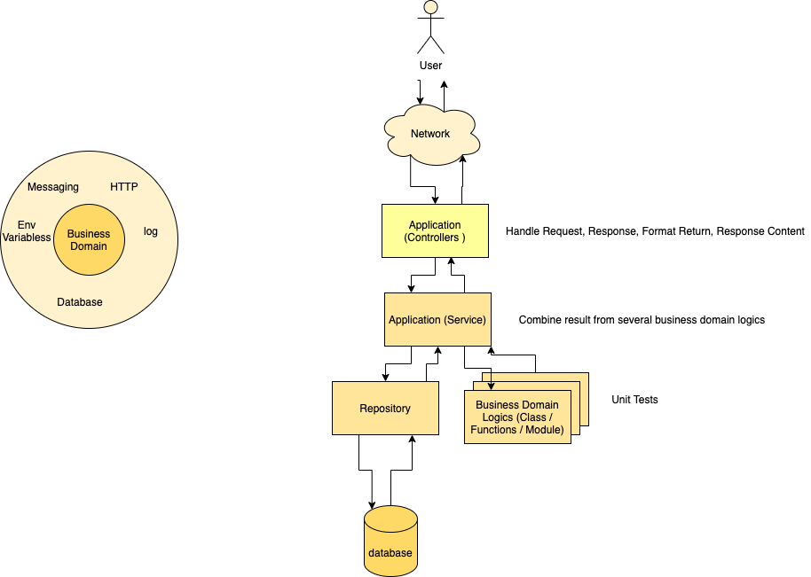

# Production Level Code Guidelines
## Production Level Code
Program we write should be correct, clear, efficient, and secure.

**Correct** means that our program is done according to acceptance criteria, and have test to make sure it is indeed pass that acceptance criteria.

**Clear**

> Any fool can write code that a computer can understand. Good programmers write code that humans can understand. - Martin Fowler

**The key to clear code is you need to write it for the sake for your friend to read, not just for computers to run.**

Your code should be written as if it is written in English. Simple, straightforward, no hidden meaning.

```python
is_valid_name = validate_name(fullname)

return "ok" if is_valid_name else "not ok"
```

It should be readable, so that we can actually skim it, read fast, and can understand the meaning just by reading it at first time without having to look in detail. Other engineers who look at the code,should understand a glimpse of what we’ve done by skimming the code.  More of this later.

**Efficient**

After our code is correct and clear, it should be efficient in terms of time and space complexity. We should use proper data structures and efficient algorithm for a problem we try to solve. Understand trade-offs between time and space usage, then adopt the most efficient way given problem we have at hands.

For example in Python, for checking for a value in an iterable (tuple, list, set, dictionary), use dictionary or set, it will give constant O(1) time retrieval instead of O(n).

```python
# don't do this
data = [2,3,1,2,4,5]
found = 2 in data

# do this
data = {2,3,1,2,4,5}
found = 2 in data

```

**Secure**

Follow [OWASP Top 10](https://owasp.org/www-project-top-ten/) for web application security risk.

Implements and assess them regularly.

Tell your tech leads if you encounter issue about this.

### Writing Correct Code and Being Defensive
Oftenly, we solve a given problem by writing program just to make sure that it is finished. It is compiled, test against a simple value, test against wrong value, seems correct, think it’s done, and ship it. But, things that looks correct for one case, could be incorrect for others.  A function that needs an unsigned integer, but inputted a signed one can cause incorrect results, and at some case devastating.

So, how can we make sure our code is correct?

#### Write Proper Test Cases
Write proper test cases ensuring that our code is correct for every possible values.

*Healthy programs have code coverage about 70-75 percent*.

You can try some problems at LeetCode, and see how many test cases written to make sure that the program is correct.

#### Defensive Programming
Make sure function and methods are defensive against invalid values, such as nulls.

Throw exception or assertion early helps too. Fail fast early will help you go a long way.

For example

```python
def add_number(first: int, second: int):
	assert first is not None, “first number should not be None”
	assert second is not None, “second number should not be None”

	return first + second

```

Also, never ever ever ever silence an exception catch. This will produce hard-to-debug-nasty bug.

```python
try:
	do_things_exception_throwing()
except Exception e:
	pass // NEVER DO THIS! THIS IS EVIL!
```

Some modern programming language like Scala has an Optional type to helps nullability check. Use it, it will prevent your program from crashes, because of the infamous null pointer exception.

### Learn More About Computer Science

#### Algorithm Complexity

Learn Big O Notation and what’s the meaning of it.

You should learn this to understand the cost of algorithm you create to solve a problem, given number of N.

Source: [Big O Notation | Interview Cake](https://www.interviewcake.com/article/python3/big-o-notation-time-and-space-complexity?)

#### Learn Common Data Structures

Understand commonly used data sructures:

- Linked List
- Array
- Set
- Map / Dictionary / HashMap
- Tree
- Queue
- Stack

You can learn it interactively on LeetCode [learn page](https://leetcode.com/explore/learn/).

#### Less is more
By minimizing what we need to do to achieve something, we can do more.

Strive to write less code, simplify everything.

You can start by writing a lot of code, then you need to refactor it to produce leaner code.

#### There are tradeoffs for everything
In computer science, there is no silver bullet, no single solution for every problem out there, there is only an optimal solution and non-optimal solution.

**Our goal is to use optimal solution given the case**

For example, on recursion vs iterative approach.

Unoptimise recursion is simple and fairly easy to read, but it will produce N stack that causes famous Stack Overflow error. While iterative approach is ease on memory usage but not simple to grasp.

Another example, doing linear search on a list is easy to do, but with large number of elements, in worst case scenario (target element is in the last element), it will be slow. Use binary search instead.

So make sure you *understand what common algorithms*, like brute force, greedy, dynamic programming, sorting, etc *and common data structures*, like array, linked-list, set, map, tree, stack, and queue *and its tradeoffs*.

### Writing Clear Code

#### Use clear names for every variables, functions, and methods
Don’t make readers need to guess what it is by looking at implementations details.
Unless it has type inference, add types to clarify its data types

```python
# don't do this
value = 12
usr = {"id": "qwewq12421", "name":"mamazo", "age": 17}

def get_usr():
	return {"id": "qwewq12421", "name":"mamazo", "age": 17}

# do this
REQUEST_TIMEOUT_S = 12
active_user = {"id": "qwewq12421", "name":"mamazo", "age": 17}

def get_active_user():
	return {"id": "qwewq12421", "name":"mamazo", "age": 17}
```

More on this in [Naming Cheatsheet](./details/naming-cheatsheet.md)

#### Use comment to explain vague part of the code. Don’t explain each lines

```javascript
// don't do this
function getUsername(fullname) {
	// split names into array
	const names = fullname.split(" ");

	// get names length
	const nameLength = text.split(" ").length;

	// create username
	const username = names[0] + "." + names[nameLength-1];
	return nameLength === 1 ? fullname : username;
}

// do this
function getUsername(fullname) {
	const names = fullname.split(" ");
	const nameLength = text.split(" ").length;
	const username = names[0] + "." + names[nameLength-1]; // <firstname>.<lastname> format
	return nameLength === 1 ? fullname : username;
}
```

#### Do One Thing
Most of bugs and complexities in codes happens by writing one thing to be 2 or more things.

Let’s take a look at this code:

```typescript
public async closeTicket(partnerId: string, channelId: string): Promise<boolean> {
	const id = partnerId + "~" + channelId;
	const deleteHandover = await this.redisRepo.srem(this.HANDOVER_KEY, id);
	const deleteRequest = await this.redisRepo.srem(this.REQUEST_KEY, id);
	return Boolean(deleteHandover) || Boolean(deleteRequest);
}

public async closeTicketFromUser(partnerId: string, channelId: string): Promise<boolean> {
	const id = partnerId + "~" + channelId;
  const channel = await this.channelManager.getChannel(channelId);
  const agent = await this.agentManager.getAgent(channel.agentId);
	const options = {
	    body: {
	        id,
	    },
	    json: true,
	    method: "POST",
	    url: agent.closeUrl,
	};
	await request(options);

	return await this.closeTicket(partnerId, channelId); // this makes tightly coupled wih closeTicket
}
```

`closeTicketFromUser` has dependencies with `closeTicket` and `closeTicket` called redis to remove a ticket id from a set in redis.

`closeTicketFromUser` tightly coupled with `closeTicket`, when we want to just call the API without having to remove the state we can’t do that without separating them.

We can refactor the code into:

```typescript
public async closeTicket(partnerId: string, channelId: string): Promise<boolean> {
	const id = partnerId + "~" + channelId;
	const deleteHandover = await this.redisRepo.srem(this.HANDOVER_KEY, id);
	const deleteRequest = await this.redisRepo.srem(this.REQUEST_KEY, id);
	return Boolean(deleteHandover) || Boolean(deleteRequest);
}

public async closeTicketFromUser(partnerId: string, channelId: string): Promise<object> {
	const id = partnerId + "~" + channelId;
  const channel = await this.channelManager.getChannel(channelId);
  const agent = await this.agentManager.getAgent(channel.agentId);
	const options = {
	    body: {
	        id,
	    },
	    json: true,
	    method: "POST",
	    url: agent.closeUrl,
	};
	return await request(options);
}
```

Then in main function or in a service method we can call it:

```typescript
public async main() {
	try {
		const partnerId = "124";
		const channelId = "421";
		await closeTicketFromUser(partnerId, channelId);
		await closeTicket(partnerId, channelId);
  } catch(e) {
		console.log("Oops, error happens", e);
	}
}
```

#### Pure Function
In functional programming paradigm, there is a terminology called pure function, what does that mean?

Let’s see this simple basic function like this:

```javascript
function double(x number) {
	return 2 * x;
}
```

what we see is a function signature that has one parameter and returning a value.

It only has 3 main super basic computation steps:

* Input
* Process
* Output

Why this simple process matters? If we see this pure function does not have any side effects (changing states), its just input, process, output.

This function can run on 1 machine or load balanced to many instances without worrying about any error.

By using clear naming, doing small, do one thing, and pure function, you make sure each functions are clean and testable.

#### Don’t Repeat Yourself (DRY)

Also one of the most common reason of common bugs happens when you repeat yourself, like copying and pasting snippet of code in many places in an application.

The danger of this approach is when there’s an update to your program, you need to update the code you (or your friends') copy-pasted. If there are many of them, you need to change them all.

For example, let’s say you have this class, that will create user and has helper method `create_random_id` that will generate random string used as user id.

```python
# user_service.py

class UserService:
	def __init__(self, repo: UserRepo):
		self.repo = repo

	def create_user(self, user_data) -> User:
		user_id = self.create_random_id()
		(user, ok) = self.repo.insert(user_id, user_data)
		return user if ok else None

	def create_random_id(self) -> str:
		"""
		create random id
		"""
		id_length = 10
    	numbers = "0123456789"
    	nums = []
    	append = nums.append

	    for index in range(id_length):
	        rand_number = choice(numbers)
	        append(rand_number)

	    return "".join(nums)
```

In other class we also have the same `create_random_id`. If this is in the beginning of the application, it's not gonna be a problem, both functions carry-on its duties well.

```python
# order_service.py

class OrderService:
	def __init__(self, repo: OrderRepo):
		self.repo = repo

	def create_order(self, order_data) -> User:
		order_id = self.create_random_id()
		(order, ok) = self.repo.insert(order_id, order_data)
		return order if ok else None

	def create_random_id(self) -> str:
		"""
		create random id
		"""
		id_length = 10
    	numbers = "0123456789"
    	nums = []
    	append = nums.append

	    for index in range(id_length):
	        rand_number = choice(numbers)
	        append(rand_number)

	    return "".join(nums)

```

But, if the requirement changes, and random id for the next version of the application needs to be changed to alphanumeric. Then we need to change both `user_service.py` and `order_service.py`. So, the `create_random_id` should be placed in a module of itself, let's say `random_generator`

```python
# common/random_generator.py

def create_random_id(self) -> str:
		"""
		create random id
		"""
		id_length = 10
    	chars = "0123456789abcdefghijklmnopqrstu"
    	nums = []
    	append = nums.append

	    for index in range(id_length):
	        rand_number = choice(chars)
	        append(rand_number)

	    return "".join(nums)
```

then called from services class

```python

# order_service.py

from app.common.random_generator import create_random_id

class OrderService:
	def __init__(self, repo: OrderRepo):
		self.repo = repo

	def create_order(self, order_data) -> User:
		order_id = create_random_id()
		(order, ok) = self.repo.insert(order_id, order_data)
		return order if ok else None

```


#### YAGNI

> You ain’t gonna need it

Sometimes as a software engineer we tends to foresee things and try to implements functionalities that currently are not needed now.
This leads to over-engineering. Requirements usually change and our guess sometimes wrong.

We spend a lot of time working on a feature that doesn’t exist yet and when it is not needed in the end, we sadly remove them.


>Always implement things when you actually need them, never when you just foresee that you need them. - Ron Jeffries, XP co-founder

#### Write Small

Software development is about breaking one system into smaller features, develops them, and combines them into a system that work each other. Generally, smaller unit makes it easier for us to read and understand the algorithm used or what it actually does under the hood.

*Small Class*

Smaller class makes it singly responsible, it is focused on solving specific features and easier to read.

Several best practices:

* Between 100 or 200 lines of code (from Sandy Metz and Uncle Bob)
* Set a max line widths of your class, for example 100-120 characters.

If it's bigger than that rules above, you need to break it.

*Small Methods / Functions*

Smaller method / function makes it easy to read, debug and update. Several best practices:

* Maximum of 4 parameters, hash options are parameters. (Sandy Metz’s Rule)
* No longer than 20 lines of code (Clean Code)


### Well Documented

It is a good practice to document your code to tell what it's all about.

It will help in the long run for other maintainers of the code to understand the methods / functions or classes' behaviour.

Public methods / functions should always documented with parameters type and its descriptions, return values type and description, and exceptions if it throws one.

```python

# class documentation of user.py module

"""
user module
"""

class UserService:
	"""
	UserService is a service for User

	It manages creating, updating, and deleting user
	"""

	def create_user(self, user_dto: UserDTO):
		"""
		Create new user

        Args:
            user_dto (UserDTO): user data from user

        Raises:
            Exception: return Exception if user face is not clear

        Returns:
            User: User object
        """
		pass
```


### Structured and Organized

We need to organize by functionality or domain, separate package, modules or class based on domain.

For backend service project, usually we have controllers (api and routers), service, and database accessing module (DAO, active record, repository pattern). It is a good practice if we don’t separate based on classification of pattern.

Instead, we separate by domain model:

```
src
	authentication
		controllers
		service
		repository
		utils
		tests
	search
		controllers
		service
		repository
		utils
		tests
```

For frontend project we can separate by components or modules.

```
modules
	homescreen
		forms
		utils
		tests
	users
		list
		assets
		tests

	// for generic components that is used throughout the project
	components
		buttons
		forms
		tests
```

## Scaling Code
### SOLID Principles

SOLID principles is object-oriented design principles by Robert C. Martin or Uncle Bob.

These principles establish practices that lend to developing software with considerations for maintaining and extending as the project grows. Adopting these practices can also contribute to avoiding code smells, refactoring code, and Agile or Adaptive software development.

More details [here](https://www.digitalocean.com/community/conceptual_articles/s-o-l-i-d-the-first-five-principles-of-object-oriented-design#interface-segregation-principle)

### Use Polymorphism and Generics

You can use polymorphism to replace if-else for certain class type.

```python
class Animal:
	def make_sound():
		# no implementation
		pass

class Dog:
	def make_sound():
		return "Guk..Guk.."

class Cat:
	def make_sound():
		return "Myawww.. meongg"

# do this
class Main:
	def start_animal_sound():
		animals = [Dog(), Cat()]

		for animal in animals:
			print(animal.make_sound())

# not this
class Main:
	def start_animal_sound():
		animals = [Dog(), Cat()]

		for animal in animals:
			if type(animal) == Dog:
				print(animal.make_sound())
			else if type(animal) == Cat:
				print(animal.make_sound())
```

### Open Sourcing Common Tools

If you think that a common functionalities will have a greater benefits for engineer out there consider make it open source.

Like we did in the pas with Merapi and its plugins, but do it better.

You can see great examples, like this:

- [Google's UUID](https://github.com/google/uuid)

- [FakerJS](https://github.com/Marak/Faker.js)

## Test Driven Development (TDD)
Our goal is the develop correct, clear, and efficient software, and the key for quality is testing. The early we create tests, the early we introduce quality on our program.

Not only that, the quality we keep at the start, should be kept as long as the program is still in use. In the long run specification will change, there will be new features, we need to make sure that our porgram still behave correctly whenever a new feature is added, or a module is modified.

TDD in short: once we got a *clear* requirements, we create tests first before writing our implementation, then we develop program to pass those tests.

### Begin at The End
In the *7 Habits of Highly Effective People*, habit no 2:

*Begin at the end of mind*

The principles told us when we want to achieve something in life and in this case, great software products, we need to start to have clear goals of what we want to achieve in the end. When the end results is clear, we need to just work towards the end goal.

### Anatomy of an Application



In this picture, we use Unit Test to test business logic of the application. Business logic of the application should be placed in the smalles unit, function or methods.

The business logics should be written in pure function, so that it is easy to test.

### Steps to Do TDD

0. Get clear specifications or requirements of the program
1. Make test cases based on acceptance criteria on the story
2. Make skeleton to make it compile
3. Write program to pass the tests
4. Refactor our code to clean up

### Demo

You can see watch demo [here](https://drive.google.com/file/d/1950WvZMih94hUXp-YWiQrDvWvzMG1cdf/view)

#### Writing Test Cases

#### Unit Test

Testing business logics for your application

* Test smallest unit of the program: functions or classes
* Don’t connect to external dependencies like database, external APIs, you need to create fake, mocks, or stubs
* Need to run fast, independent, repeatable
* One assert per test
* Code coverage is between 70-75 percent

#### Integration Test

Testing functionalities of the application that consists of one or more modules. One module can have several classes or functions.

* Connects to database or external APIs.
* Use tools like docker-compose or fake external APIs to create external dependencies.

#### Tools

Several tools to help Unit Testing:
* Fake
* Mock
* Stub
* Testing Frameworks: Pytest, xUnit, Jest, etc

### Do we actually need TDD?

* Yes, if you’re writing production intended software, means you write business value generated software, that other people will use.
* Yes, if you're writing Open Source software.
* No, if you’re doing research of or a prototype intended to test a libraries of other softwares or APIs.
* Optional, if you’re programming to have fun on the weekend.
* Optional, if you’re still learning to program.

So, if you write program that have values and for other people to use, you need to implement TDD.

### Best Practice on Unit Testing

[Best practices for writing unit tests - .NET | Microsoft Docs](https://docs.microsoft.com/en-us/dotnet/core/testing/unit-testing-best-practices)

